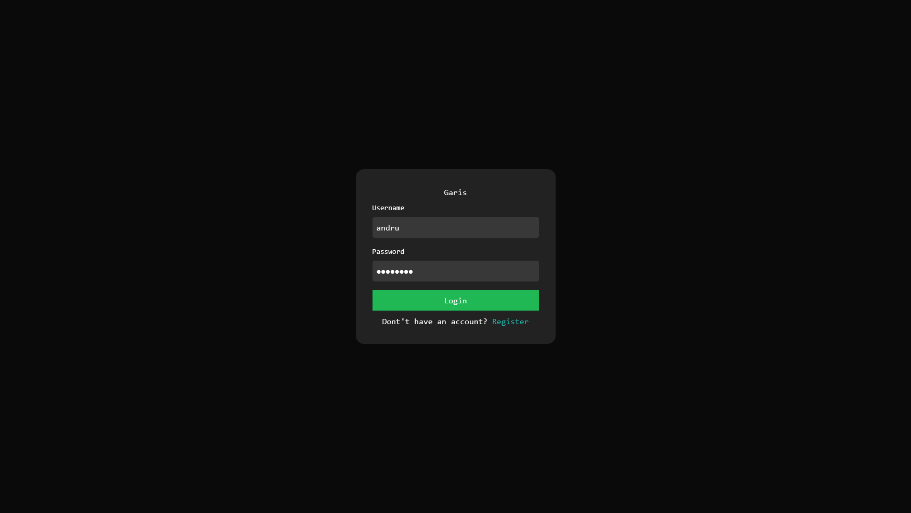
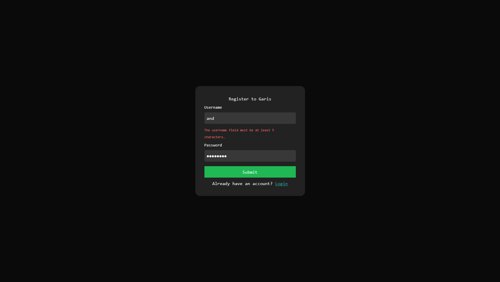
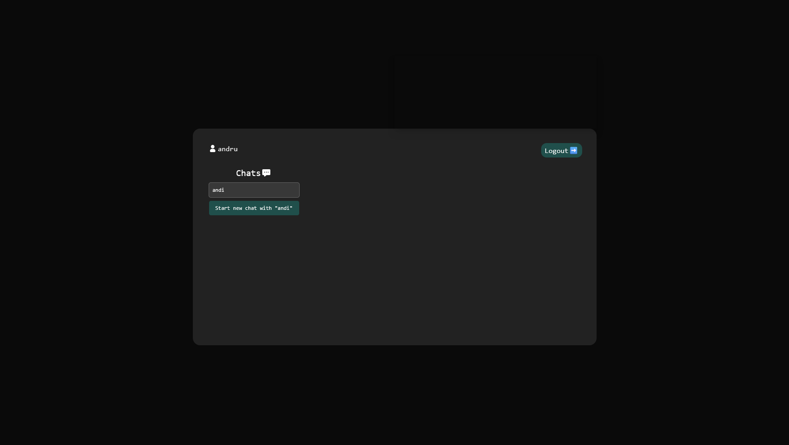
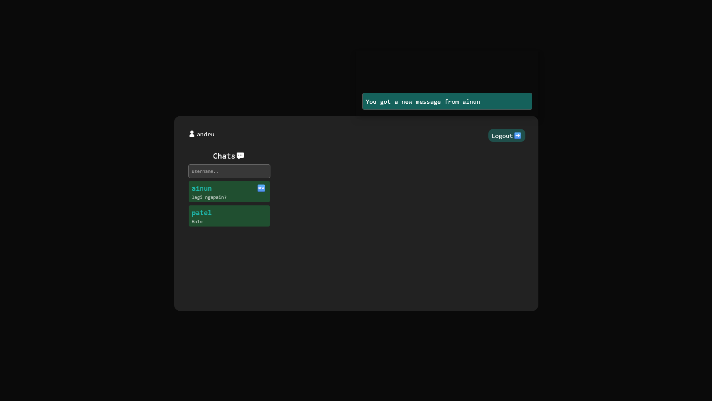

# 💬 Realtime Chat App — Laravel + Livewire + Pusher

A simple yet powerful realtime chat application built with **Laravel**, **Livewire**, and **Pusher**.  
This project demonstrates my understanding of backend logic, realtime communication, and clean code architecture in a modern PHP stack.

---

## 🚀 Features

- 🔐 **User Authentication** (Register & Login)
- 💬 **1-to-1 Realtime Chat**
- ⚡ **Live Message Updates** via Pusher
- 🎨 **Responsive UI** built with Tailwind CSS
- 🗄️ **Database**: MySQL (or compatible)

---

## 🧠 Tech Stack

| Layer | Technology |
|-------|-------------|
| Backend | Laravel 11 |
| Frontend | Blade + Livewire |
| Realtime | Pusher Channels |
| Database | MySQL |
| UI | TailwindCSS |
| Deployment | Local / Docker / Optional VPS |

---

## ⚙️ Installation & Setup

> Make sure you have PHP 8+, Composer, Node.js, and MySQL installed.

```bash
# 1. Clone the repository
git clone https://github.com/username/chatapp-laravel.git
cd chatapp-laravel

# 2. Install dependencies
composer install
npm install && npm run build

# 3. Copy environment file
cp .env.example .env

# 4. Set up environment variables
# (update .env with your database & Pusher credentials)
php artisan key:generate

# 5. Run migrations
php artisan migrate

# 6. Start the server
php artisan serve
```
Now open your browser and visit: <br>
👉 http://localhost:8000

## 🔧 Environment Variables
Below is a template for your .env.example file.
Do not commit real secrets — this is just an example for setup.
```bash
APP_NAME="ChatApp"
APP_ENV=local
APP_KEY=
APP_DEBUG=true
APP_URL=http://localhost

DB_CONNECTION=mysql
DB_HOST=127.0.0.1
DB_PORT=3306
DB_DATABASE=chatapp
DB_USERNAME=root
DB_PASSWORD=

# Pusher configuration for realtime chat
PUSHER_APP_ID=
PUSHER_APP_KEY=
PUSHER_APP_SECRET=
PUSHER_APP_CLUSTER=ap1
```

## 🖼️ Screenshots







## 💡 What I Learned
- Implemented realtime chat using Laravel Events & Broadcasting
- Integrated Pusher Channels with Livewire for instant updates
- Designed a clean, responsive chat interface with TailwindCSS
- Structured Laravel projects for scalability and maintainability

## 🗃️ Future Improvements
-   🧑‍🤝‍🧑 Group Chat
-   🔍 Message Search
-   📎 File/Image Attachments

